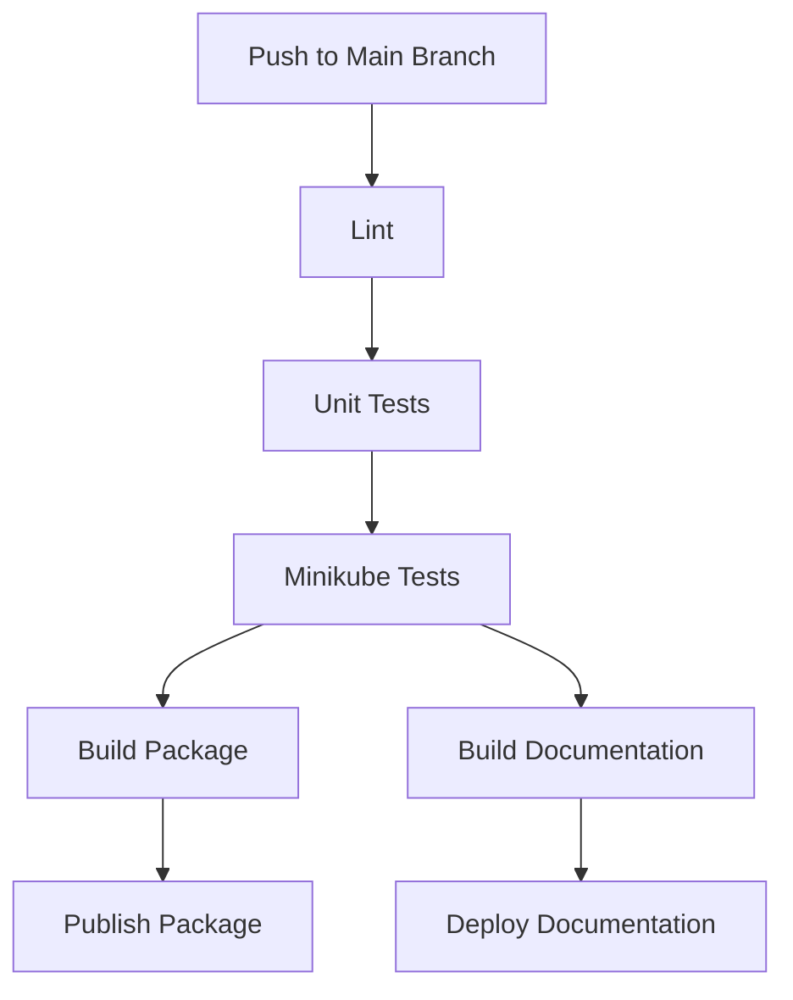

# CI/CD Pipeline

The CNI Migration Tool uses a comprehensive CI/CD pipeline to ensure code quality, test functionality, and automate releases.

## Pipeline Overview

The CI/CD pipeline consists of the following stages:

1. **Lint**: Check code quality and formatting
2. **Unit Tests**: Run unit tests with different Python versions
3. **Minikube Tests**: Run integration tests with Minikube for different CNIs and Kubernetes versions
4. **Build Package**: Build the Python package
5. **Publish Package**: Publish the package to PyPI
6. **Build Documentation**: Build the documentation
7. **Deploy Documentation**: Deploy the documentation to GitHub Pages

## Pipeline Diagram



## GitHub Actions Workflow

The CI/CD pipeline is implemented using GitHub Actions. The workflow file is located at `.github/workflows/ci-cd.yml`.

### Lint Stage

The lint stage checks code quality and formatting using:

- flake8: Check for syntax errors and code style
- black: Check code formatting
- isort: Check import order

### Unit Tests Stage

The unit tests stage runs unit tests with different Python versions:

- Python 3.8
- Python 3.9
- Python 3.10

It also generates a code coverage report and uploads it to Codecov.

### Minikube Tests Stage

The Minikube tests stage runs integration tests with Minikube for different CNIs and Kubernetes versions:

- CNIs: Calico, Flannel, Weave
- Kubernetes versions: v1.24.0, v1.25.0, v1.26.0

It sets up Minikube with the specified CNI and Kubernetes version, runs the tests, and collects logs on failure.

### Build Package Stage

The build package stage builds the Python package using the `build` package.

### Publish Package Stage

The publish package stage publishes the package to PyPI when a new tag is pushed.

### Build Documentation Stage

The build documentation stage builds the documentation using MkDocs.

### Deploy Documentation Stage

The deploy documentation stage deploys the documentation to GitHub Pages.

## Running the Pipeline Locally

You can run parts of the pipeline locally to test your changes before pushing them to GitHub.

### Lint

```bash
pip install flake8 black isort
flake8 .
black --check .
isort --check-only --profile black .
```

### Unit Tests

```bash
pip install pytest pytest-cov
pytest tests/test_comprehensive.py -v --cov=lib
```

### Minikube Tests

```bash
cd tests/minikube
./run-tests.sh --cni calico
```

### Build Package

```bash
pip install build
python -m build
```

### Build Documentation

```bash
pip install mkdocs mkdocs-material
mkdocs build
```

## CI/CD Pipeline Configuration

The CI/CD pipeline can be configured using environment variables and GitHub secrets:

- `MINIKUBE_MEMORY`: Memory allocated to Minikube (default: 4096)
- `MINIKUBE_CPUS`: CPUs allocated to Minikube (default: 2)
- `PYPI_API_TOKEN`: PyPI API token for publishing the package (GitHub secret)

## Adding New Tests to the Pipeline

To add new tests to the pipeline, you can:

1. Add new unit tests to the `tests` directory
2. Add new Minikube tests to the `tests/minikube` directory
3. Update the GitHub Actions workflow file to include the new tests
